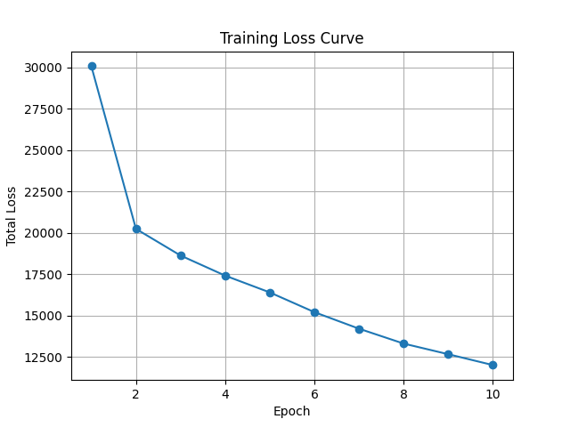
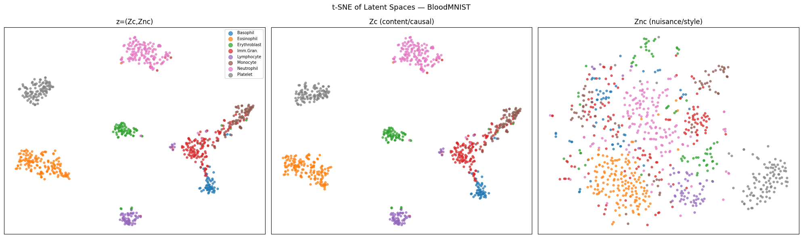
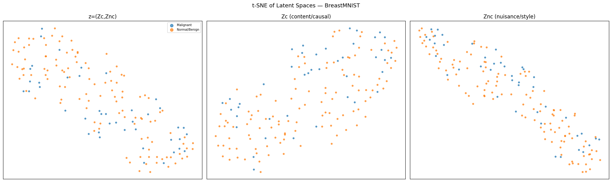
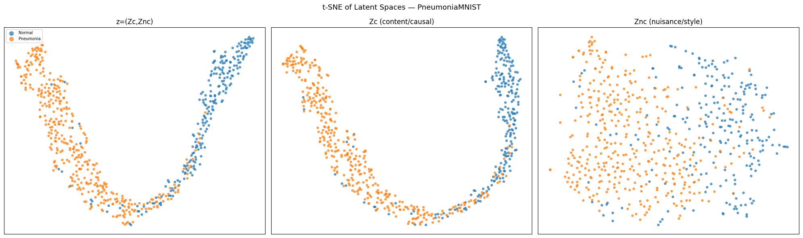
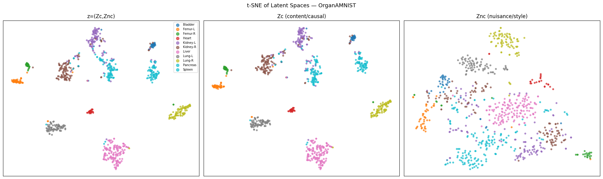

# SEMI-CAVA: Semi-Supervised Causal Variational Autoencoder

This repository implements **SEMI-CAVA**, a semi-supervised deep generative framework that combines variational inference with causal representation learning. The model disentangles latent space into class-relevant and nuisance factors and improves performance using mixup-based consistency regularization.

---

## 🚀 Key Idea

The model learns two latent representations:

- **Zc (causal / class-relevant features)**  
- **Znc (nuisance / style features)**  

A classifier is trained only on Zc, while the decoder reconstructs input using both latents, enforcing structured disentanglement.

---

## 🧠 Model Components

- **Encoder**: CNN-based feature extractor
- **Latent Heads**:
  - Mean + variance for Zc
  - Mean + variance for Znc
- **Classifier**: operates on Zc only
- **Decoder**: reconstructs input from Zc, Znc, and class conditioning
- **Loss Function**:
  - ELBO (labeled + unlabeled)
  - Cross-entropy loss
  - Mixup-based consistency loss

---

## 📊 Training Setup

- Dataset: MNIST (grayscale → 3-channel conversion)
- Labeled samples: 1000
- Optimizer: Adam
- Batch size: 64
- Epochs: 10–15 (configurable)

---

## 📈 Results

| Epoch | Loss ↓ | Accuracy ↑ |
|------|--------|------------|
| 1 | ~32k | 0.09 |
| 5 | ~16k | 0.27 |
| 10 | ~12k | 0.55 |

### Training Curve

Loss decreases steadily over epochs, indicating stable convergence.



---

## 🧪 Evaluation

Evaluate model on test data:

```bash
python -m src.training.eval 
```

---

## ⚙️ Installation

```bash
git clone https://github.com/MetricMolecule/semi-cava-ssl.git
cd semi-cava-ssl

python3 -m venv .venv
source .venv/bin/activate

pip install -r requirements.txt
```

---

## 🚀 Running the Model

```bash
python src.training.train

---

## 📷 Medical Dataset Samples

The model was also evaluated on MedMNIST datasets.

### BloodMNIST


### BreastMNIST


### PneumoniaMNIST


### OrganMNIST (Chest)


---

## 🔗 License

MIT License

---

## 📧 Contact

Name: [Anshak]
Email: [anshak001@gmail.com]

---
